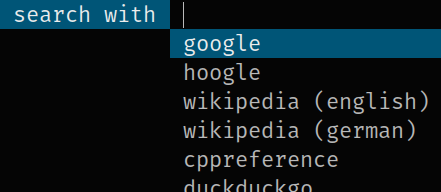

# haskell-dmenu-search
dmenu script for searching the web with customizable search engines.

Runtime Dependencies:
[dmenu](http://tools.suckless.org/dmenu/) or
[dmenu2](https://bitbucket.org/melek/dmenu2).

Installation:
  Either get the sources from this repository, or
  [from hackage](https://hackage.haskell.org/package/dmenu-pkill).

Usage:

*   `dmenu-search [OPTIONS] [-- DMENUOPTIONS]`

    Let's the user choose a search engine and enter a search string by
    spawning two subsequent `dmenu` processes, and opens the resulting
    URL in a browser.
    
    All arguments, after the first `--` argument, are directly passed to `dmenu`.

Options:

*   `-b, --browser CMD`

    Shell command to open url in browser. Default: `chromium -new-window`

*   `-e, --engine NAME URLPREFIX`

    Add a search engine, e.g.
    
        -e google https://www.google.com/search?q=
        -e github https://github.com/search?q=

*   `-E, --engine-file PATH`

    Add search engines from a file.
    
    The following shows example content of an engine file:
    
        google
        https://www.google.com/search?q=

        github
        https://github.com/search?q=

The application is build with the
[dmenu Haskell bindings](https://hackage.haskell.org/package/dmenu), which
support customizing the dmenu commandline options in a [configuration file](https://github.com/m0rphism/haskell-dmenu/blob/master/CONFIG.md).
